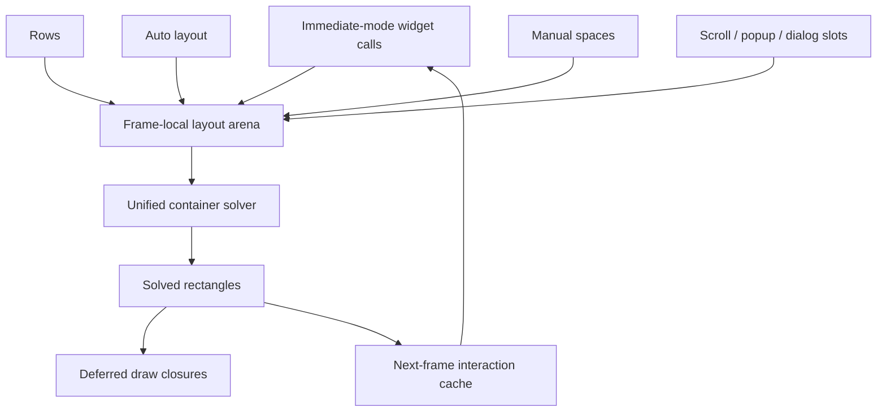
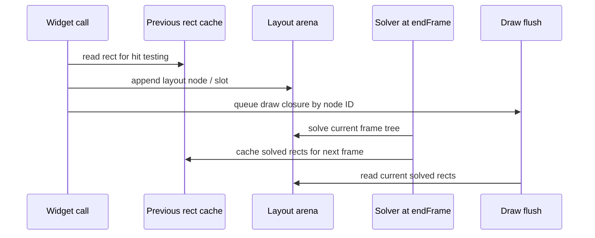

# Ops Layout Model

This is the canonical layout design for Ops. It supersedes the earlier
`layout-model.md` and `layout-model-rev1.md` drafts, which described the
container layer as future work, under a Gridmonger backward-compatibility
constraint that no longer applies.

Ops uses a single unified layout solver. Clay-inspired structural sizing
(`fixed`, `grow`, `percent`, `fit`) drives one container model, and Ops's row,
vertical auto-layout, and manual-space APIs are presets over that same model
rather than separate systems.

## Model At A Glance



Widgets still execute immediately, but their final geometry is produced later in
the frame. Draw commands are deferred until the solver has current rectangles;
pointer interaction uses the previous frame's rectangles.

## Status & Context

Ops is a small immediate-mode UI library for Nim. UI is described by widget
calls every frame; interaction, layout, style, focus, and draw state live in the
central runtime state (`UIState` / `g_uiState` in `ops/core.nim`).

What already exists and is headless-tested:

- Unified frame-local layout arena and solver with `fixed`/`grow`/`percent`/
  `fit` sizing, follower placement, same-frame solved drawing, and previous-frame
  interaction rects (`ops/layout.nim`, `ops/internal/layout_solver.nim`).
- Vertical auto-layout: `AutoLayoutParams`, `autoLayoutPre`/`autoLayoutPost`
  (`ops/layout.nim`, `ops/types.nim`).
- Row layout with columns: `ColMode` = `cmStatic`/`cmDynamic`/`cmRatio`/
  `cmVariable`, `beginRowLayout`, `layoutRow`, `col`/`colDynamic`/`colRatio`/
  `colVariable` (`ops/layout.nim`).
- Layout spaces: `lmSpace`, `beginSpaceLayout`, the draw-offset stack
  (`ops/drawing.nim`), and the screen/local coordinate helpers.
- Scroll views (`beginScrollView`), virtual list (`listView`/`listViewRange`),
  dialogs, and popups (`beginPopup`) integrated with layout slots.
- Per-widget retained state in `itemState: Table[ItemId, ref RootObj]`
  (`ops/core.nim`), keyed by call-site-stable IDs (`nextId`, `ops/input.nim`).
- Pure layout/algorithm tests under `tests/`.

The model this document records:

- A unified container solver with `fixed`/`grow`/`percent`/`fit` sizing on both
  axes and a defined multi-pass solve.
- An execution model that resolves the immediate-mode ordering problem without
  stale visuals or double evaluation.

Posture change: Gridmonger backward compatibility is no longer a constraint. The
goal is one correct model, designed deliberately, even where that replaces
current types and call styles.

## Unified Model

There is one layout primitive: a container node with independent width and
height sizing. Everything else is a preset over it.

| Today | Becomes |
| --- | --- |
| `col(w)` (`cmStatic`) | child with `fixed(w)` |
| `colRatio(r)` (`cmRatio`) | child with `percent(r)` |
| `colDynamic` (`cmDynamic`) | child with `grow()` |
| `colVariable(min)` (`cmVariable`) | child with `grow()` and a `min` |
| `layoutRow(h, cols)` | left-to-right container, `fixed(h)` tall |
| vertical auto-layout | top-to-bottom container with default child sizing |
| `layoutSpace(h)` | container with manual (absolute) child placement |

The existing `LayoutNode`, `LayoutMode`, `LayoutColumn`, and `ColMode` types are
**replaced** by the unified node and `LayoutSize`. This also removes the name
collision between the current `LayoutNode`/`LayoutDirection` and the ones
introduced here. The row, auto-layout, and space templates remain as the
ergonomic surface; they construct unified nodes underneath.

Widgets (button, slider, text field, …) are not layout nodes themselves. They
receive a solved rectangle and run their normal cycle inside it. Only
containers, text nodes, scroll regions, and row blocks participate in the solve.

```text
Public API surface                    Unified representation

menuBar / auto layout  ─────┐
row / columns          ─────┼──▶  LayoutNode(direction, size, padding, gap)
manual space           ─────┘

button / slider / text field ─▶  normal widget behavior + deferred draw
```

## Sizing

Each axis of a container declares its sizing independently:

- `fixed`: a fixed pixel size on that axis.
- `percent`: a fraction of the parent content size on that axis.
- `grow`: a share of the parent's remaining space on that axis.
- `fit`: shrink-wrap to intrinsic child content on that axis.

A sidebar can be `fixed(300)` wide and `grow()` tall. A main pane can `grow()`
on both axes. A popup can `fit()` to its contents.

```text
Parent content width: 900

┌──────────────┬────────────────────────┬────────────────────────┐
│ fixed(220)   │ percent(0.30) = 270    │ grow() = remaining 390 │
└──────────────┴────────────────────────┴────────────────────────┘
       220                    270                      390

Remaining space is assigned after fixed, percent, padding, and gaps.
```

`fixed`, `percent`, and `grow` are resolvable top-down once the parent size is
known. Only `fit` (and text-wrapped height) requires bottom-up measurement of
content; that is the source of the ordering problem the execution model below
solves.

Aspect ratio is an optional node constraint. If one axis is fixed or already
resolved and the other axis is flexible, the solver derives the flexible axis
from `aspectRatio`. If both axes are fixed, the explicit sizes win.

```nim
let preview = layoutNode(width = fixed(160), height = fit(), aspectRatio = 16 / 9)
```

## Common Layout Shapes

These examples show the shipped solver behavior in the terms application code
actually uses.

### Fit And Wrapped Text

A fit-height text node grows its row after text measurement, then later siblings
are placed below the solved height in the same frame.

```text
Before wrap measurement              After solve

┌──────────────────────────────┐      ┌──────────────────────────────┐
│ label: fixed width, fit h    │      │ label line 1                 │
├──────────────────────────────┤      │ label line 2                 │
│ button below                 │      │ label line 3                 │
└──────────────────────────────┘      ├──────────────────────────────┤
                                      │ button below                 │
                                      └──────────────────────────────┘
```

```nim
initAutoLayout(params)
label("A long label that wraps inside the current row width")
button("Next row follows the solved text height")
```

### Scroll Views

Scroll views are containers with a clipped viewport. Child layout is solved in
content space; generated scrollbars are follower nodes that track the solved
viewport rectangle without becoming children of the content node.

```text
┌──────────────────────── viewport ───────────────────────┐
│ content y = -scrollY                                    │
│ ┌──────────────────────────────────────────────────────┐ │
│ │ row 0                                                │ │
│ │ row 1                                                │ │
│ │ row 2                                                │ │
│ │ ...                                                  │ │
│ └──────────────────────────────────────────────────────┘ │
│                                                  ┌─────┐ │
│                                                  │thumb│ │
│                                                  └─────┘ │
└──────────────────────────────────────────────────────────┘
```

```nim
scrollView(20, 20, 280, 180, contentH = 600):
  for i in 0 ..< 40:
    label("Visible rows are clipped by the viewport")
```

### Tables

Tables use one frame slot for the table body and a child slot for the header.
Column widths are resolved from fixed widths plus automatic shares of remaining
space.

```text
table width = 600

┌────────────┬──────────────────────┬──────────────────────┐
│ fixed 120  │ auto share 240       │ auto share 240       │
├────────────┼──────────────────────┼──────────────────────┤
│ row cell   │ row cell             │ row cell             │
└────────────┴──────────────────────┴──────────────────────┘
```

```nim
let columns = [
  TableColumn(label: "Name", width: 120),
  TableColumn(label: "State"),
  TableColumn(label: "Updated"),
]

tableView(0, 0, 600, 300, columns, rows.len, i):
  tableCell(rows[i].name)
  tableCell(rows[i].state)
  tableCell(rows[i].updated)
```

### Popup Followers

Dropdowns, color pickers, and context menus are popup-layer nodes that follow a
target rectangle solved by the current frame. The popup does not consume row
space and can clamp to the root bounds independently.

```text
normal layout layer                       popup layer

┌───────────────┐
│ combo button  │◀──────── follow target ┌──────────────────────┐
└───────────────┘                         │ popup body           │
next row starts here                      │ rows / color picker  │
                                          └──────────────────────┘
```

```nim
dropDown("Mode", @["Edit", "Preview", "Export"], mode)
colorPicker(accentColor)
```

Followers are the compatibility layer for a more general attach model. New
floating UI can attach any point on itself to any point on a parent, root, or
target node.

```nim
layoutNode(
  width = fixed(240),
  height = fit(),
  placement = attach(buttonNode, lapBottomLeft, lapTopLeft, windowPad = 10),
)
```

The attach config stores `zIndex` and `capturePointer` so popup-style widgets
can converge on one placement primitive while Ops keeps its existing draw
layers.

### Layout Diagnostics

Layout diagnostics are recoverable. The arena records errors for duplicate item
ids, invalid percent values, missing attach targets, node-capacity overflow,
unbalanced layout stacks, and internal layout failures. Invalid percents are
clamped; missing floating targets leave the node at its fallback rect. Unbalanced
frame layout stacks are reported at `finishFrameLayout()` and then cleared so the
next frame starts from clean layout state.

```nim
arena.setLayoutErrorHandler(proc(error: LayoutError) =
  echo error.kind, ": ", error.message
)
```

Applications can also configure the active UI arena directly:

```nim
setLayoutErrorHandler(proc(error: LayoutError) = echo error.message)
setLayoutMaxNodes(4096)
let errors = layoutErrors()
clearLayoutErrors()
```

The built-in inspector is opt-in and drawn on `layerGlobalOverlay` after the
frame is solved. It visualizes solved node rectangles and shows the hovered
node's hierarchy, sizing, intrinsic, content, scroll, placement, z-index, and
aspect-ratio data. When rectangles overlap, hover selection follows layout
z-index first and insertion order second, matching draw-layer ordering. Clicked
selection persists as the detail node when the cursor is hovering only the root
rectangle. The panel also includes current layout diagnostics, with errors
related to the detail node listed before recent global errors. A tree browser at
the top of the panel lists visible layout nodes in solve order; rows can be
selected, container subtrees can be collapsed, and mouse wheel input scrolls long
trees without affecting application scroll views.

```nim
setLayoutInspectorEnabled(true)
toggleLayoutInspector()
let detailNode = layoutInspectorDetailNode()
let detailLines = layoutInspectorDetailLines()
let errorLines = layoutInspectorErrorLines()
let rows = layoutInspectorTreeRows()
```

The visual regression examples live in [examples](/examples): the inspector,
attach, aspect, diagnostics, and stress demos are built with `nimble
layoutDemos`. WebGPU example tasks auto-select Ops's native Zig Wayland path on
Linux Wayland sessions and GLFW on X11, macOS, and Windows.

## Execution Model

The solver needs the layout tree built before it can assign rectangles. Widget
behavior and drawing need rectangles. In a single-evaluation immediate-mode
library these cannot both happen synchronously inside one widget call.

Ops already resolves half of this: **drawing is deferred.** `addDrawLayer`
queues `DrawProc` closures into draw layers, and `endFrame` flushes them
(`ops/drawing.nim`, `ops/lifecycle.nim`). Ops records draw commands during the
frame and paints at the end; it does not paint synchronously.

The adopted model extends that deferral to layout, following Clay's actual
design: layout is solved fresh every frame and rendered the same frame, while
only pointer interaction reads the previous frame's geometry.

Per-frame widget cycle:

1. Look up the **previous frame's solved rect** for the widget's stable ID
   (cached in `itemState`).
2. Hit-test and run behavior (hot/active/focus, and any return value such as
   `button(): bool`) against that rect.
3. Record a node into this frame's layout arena.
4. Queue a draw closure that references the node **by ID/index**, not by a baked
   rectangle.

At `endFrame`:

1. Run the full solve over the arena (all passes below, including `fit` and text
   wrap).
2. Cache each node's solved rect per ID for the next frame's step 1.
3. Flush draw closures using the freshly solved rects.

Consequences:

- **Visuals are always current.** The solve runs before draws flush, in the same
  frame. Resizes, `fit` containers, and popups paint at correct size on the
  frame they appear.
- **Interaction is one frame behind.** Hit-testing uses last frame's geometry.
  At interactive frame rates this is imperceptible and self-correcting, because
  layout rarely changes geometry during an active interaction. This is the same
  trade-off Clay makes (`Clay_Hovered` reads the prior layout).
- **Single evaluation.** Widget bodies run once per frame. No suppressed
  measurement pass, no double evaluation, no declaration/render macro split.

This **replaces** the earlier "one-frame lag" recommendation, which lagged
visuals as well as interaction. Lagging visuals produces wrong-sized popups on
open and jitter on resize; lagging only interaction does not.

Cost to absorb, recorded honestly: a widget's internal layout math — slider
handle position, text-field cursor and selection geometry, scrollbar thumb
extent — currently runs at call time against a known rect. Under this model that
math moves into the deferred draw closure (or into child layout nodes), because
the final rect is not known until the end-of-frame solve. Migrating each
widget's draw to the ID/rect-deferred form is the bulk of the implementation
work.

The one-frame interaction-lag semantics must be documented at the call sites and
in tests so they are not mistaken for a bug.



## Solve Algorithm

The solver uses a frame-local layout tree, rebuilt every frame from
immediate-mode declarations and solved at `endFrame`.

Pass order:

```text
Build tree
   │
   ▼
Measure intrinsic sizes  ◀──── text preferred/min width
   │
   ▼
Resolve widths
   │
   ▼
Wrap text and update fit heights
   │
   ▼
Resolve heights
   │
   ▼
Place children and compute content sizes
```

1. **Build the layout tree.**
   - Record containers, text, scroll regions, and row blocks.
   - Store parent-child relationships in dense arrays. Children of a node are a
     contiguous slice in `childIndices`:
     `childIndices[node.firstChild ..< node.firstChild + node.childCount]`.
     Appending children during the build phase must preserve this contiguity;
     top-to-bottom immediate-mode declaration satisfies it naturally. Do not
     interleave children of different parents.
   - Do not draw widgets during this phase.
2. **Measure intrinsic sizes bottom-up.**
   - `fixed`: min and preferred size are the fixed value.
   - `fit`: derives from child content.
   - `grow`: derives from explicit minimums and waits for parent space.
   - `percent`: waits for the parent size.
   - Container main axis sums children, gaps, and padding.
   - Container cross axis takes the largest child plus padding.
   - Text reports longest-word minimum width, unwrapped preferred width, and line
     height via the `measureText` callback.
3. **Resolve widths top-down.**
   - Apply fixed and percent widths.
   - Assign fit widths from preferred size clamped by available space.
   - Divide remaining space among grow nodes.
   - If content overflows, shrink grow and fit nodes toward minimums.
4. **Wrap text and update dependent heights.**
   - Call `measureText` again with each text node's solved width.
   - Bubble changed heights through fit-height parents.
5. **Resolve heights top-down.**
   - Use the same fixed, percent, fit, grow, and shrink rules on the Y axis.
6. **Place children.**
   - Apply padding, gaps, layout direction, main-axis alignment, and cross-axis
     alignment.
   - Store final rectangles and content sizes.

Scrolling is clipping plus child offset. A scroll container's viewport can be
smaller than its content size. Renderers receive explicit scissor start and end
commands or equivalent draw-list state.

## Text Measurement

The solver requires text measurement at step 4, after widths are resolved but
before heights are finalized. It must report:

- minimum width: width of the longest single word (no wrap is possible below
  this);
- preferred width: full line length with no wrapping;
- wrapped height: line count times line height for a given solved width.

The layout arena holds a `measureText` callback provided at init:

```nim
type MeasureTextProc* = proc(
  text: string,
  fontSize: float,
  fontFace: string,
  maxWidth: float,
): TextMeasure {.closure.}

type TextMeasure* = object
  minWidth*:   float
  prefWidth*:  float
  lineHeight*: float
  lineCount*:  int
```

The callback bridges the solver and the font atlas. It is called during the
intrinsic-size pass (step 2) with `maxWidth = Inf` for preferred width and during
the text-wrap pass (step 4) with the solved container width. The implementation
wires to the existing `textBreakLines` (`ops/drawing.nim`) and renderer
`textWidth`. Headless tests use the same callback with a deterministic fallback
when no renderer context is active. The solver must not call into the renderer
directly.

## Scroll State

Scroll offset is retained state that persists across frames. It lives in the
existing `itemState` table keyed by container ID, not in the layout arena. The
arena is frame-local and does not own persistent state.

The solver reads scroll offset from the state table during the place step (step
6) to compute child positions within the scroll viewport. Input handling writes
scroll offset back to the state table after layout is complete. The solver must
treat scroll offset as read-only during its passes.

`contentSize` on a node is the total size of children before clipping. The
renderer uses it together with the viewport size and scroll offset to size and
position scroll indicators.

## Data Structures

Use dense value records and arrays. Avoid a ref-object tree. The unified node and
`LayoutSize` replace the current row/space types.

```nim
type LayoutNodeId* = distinct int32

type LayoutSizeKind* = enum
  lskFit
  lskGrow
  lskFixed
  lskPercent

type LayoutSize* = object
  min*: float  # floor applied during shrink; ignored for lskFixed
  max*: float  # ceiling applied during grow; ignored for lskFixed
  case kind*: LayoutSizeKind
  of lskFixed:
    value*: float    # min and max are both value; no shrink or grow
  of lskPercent:
    percent*: float  # 0.0..1.0 fraction of parent content axis
  of lskFit, lskGrow:
    discard

type LayoutAlign* = enum
  laStart        # pack children toward the main-axis start
  laCenter       # center children on the main axis
  laEnd          # pack children toward the main-axis end
  laSpaceBetween # distribute remaining space between children

type LayoutCrossAlign* = enum
  lcaStart    # align children to the cross-axis start
  lcaCenter   # center children on the cross axis
  lcaEnd      # align children to the cross-axis end
  lcaStretch  # stretch children to fill the cross axis

type LayoutDirection* = enum
  ldLeftToRight
  ldTopToBottom

type LayoutNode* = object
  id*:          LayoutNodeId
  parent*:      LayoutNodeId
  firstChild*:  int32   # index into childIndices; -1 if no children
  childCount*:  int32
  direction*:   LayoutDirection
  width*:       LayoutSize
  height*:      LayoutSize
  padding*:     Padding
  childGap*:    float   # gap between children along the main axis only
  alignMain*:   LayoutAlign
  alignCross*:  LayoutCrossAlign
  intrinsicMin*:  Size
  intrinsicPref*: Size
  rect*:        Rect
  contentSize*: Size    # total child extent before scroll clipping

type LayoutArena* = object
  nodes*:        seq[LayoutNode]
  childIndices*: seq[LayoutNodeId]
  measureText*:  MeasureTextProc
```

The names in code may evolve, but the ownership model should not: one arena owns
frame-local layout nodes and solved rectangles. Widget state and scroll offsets
remain in Ops's existing `itemState` tables. Solved rects are additionally
cached per widget ID across frames to feed the next frame's interaction (see
Execution Model).

## Nim Advantages

Nim can make this model cleaner than Clay's C macros or Nuklear's procedural C
API:

- Templates can give scoped layout syntax without hiding the immediate-mode
  execution model; the row/space/auto-layout presets are templates over the
  unified node.
- Macros can later generate stable source IDs and transform nested declarations
  into registration plus render blocks.
- Object variants fit `LayoutSize` without inheritance or vtables. The `percent`
  field lives inside the `lskPercent` arm and is not allocated for other kinds.
- Distinct IDs separate layout node IDs from widget item IDs.
- Dense `seq` arenas keep memory predictable and avoid GC-heavy object graphs.
- `openArray` and iterators keep child traversal and presets compact.

The first implementation should prefer templates and value objects. Macros are
useful later, once the runtime model is proven.

## Non-Goals

- Do not bind directly to upstream Clay C.
- Do not port Clay line-for-line into Nim.
- Do not copy Nuklear's C API names.
- Do not make every widget a retained layout node.
- Do not evaluate widget bodies once for measurement and again for rendering.
- Do not lag visuals; only pointer interaction may read the previous frame.

(Backward compatibility with Gridmonger and the current public call shape is no
longer a constraint and is intentionally absent from this list.)

## Implementation Status

1. Execution model and arena: same-frame solve for `fixed`/`grow`/`percent`,
   draws deferred to solved rects, interaction read from previous-frame rects.
   (done)
2. Fold rows, layout spaces, and vertical auto-layout into the unified node, with
   the presets implemented as templates over it. (done)
3. Add `fit` and text wrapping via the `measureText` callback. (done)
4. Migrate existing widgets' internal layout math into deferred draws and layout
   slots/followers. (done)

Tests for pure sizing and placement (including alignment, gap, and the
one-frame interaction-lag semantics) should accompany each stage, in the style
of the existing `tests/test_layout.nim` and `tests/test_algorithms.nim`.
